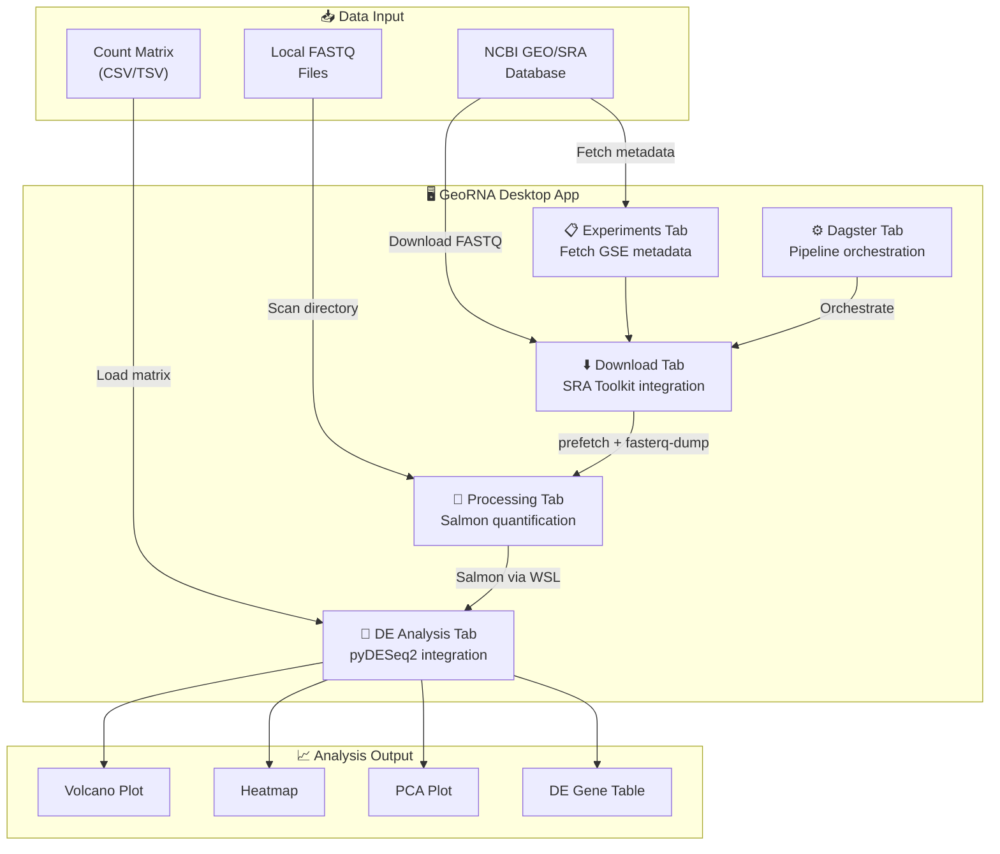

# 🧬 RNAWorkbench-GeoRNA

**A desktop application for downloading and analyzing RNA-seq data from NCBI GEO/SRA**

[](https://www.python.org/downloads/)
[](https://pypi.org/project/PyQt6/)
[](https://opensource.org/licenses/MIT)

RNAWorkbench-GeoRNA is a Qt6-based GUI application that streamlines the RNA-seq analysis workflow from raw data acquisition to differential expression analysis. It integrates with NCBI databases, the SRA Toolkit, Salmon, and pyDESeq2 to provide an end-to-end solution.


## ✨ Features

### 📋 Experiment Management
- Fetch metadata from NCBI GEO using GSE accession numbers
- Automatically retrieve BioProject IDs and SRA run accessions
- Batch import/export experiment lists (JSON)
- Visualize experiment statistics

### ⬇️ Data Download
- Download SRA files using `prefetch` from SRA Toolkit
- Convert to FASTQ format using `fasterq-dump`
- Parallel downloads with configurable thread count
- Skip already downloaded files
- Support for large files (>20GB)

### 🔬 Data Processing
- Scan for downloaded FASTQ files
- **Salmon quantification** (via WSL on Windows)
  - Automatic transcriptome download (Human/Mouse)
  - Index building and sample quantification
  - Generate count matrices
- **GEO Supplementary Files**
  - Download pre-computed count matrices directly
  - Auto-detect and load expression data

### ⚙️ Pipeline Orchestration
- **Dagster integration** for workflow management
- Pre-configured jobs for each experiment
- Launch Dagster web UI for monitoring
- Parallel execution with dependency management

### 🧬 Differential Expression Analysis
- **pyDESeq2** implementation of DESeq2
- Generate demo data for testing
- Load custom count matrices
- Interactive visualizations:
  - 🌋 Volcano plots
  - 📊 MA plots
  - 🗺️ Heatmaps (top 50 DE genes)
  - 🎯 PCA plots
- Export results to CSV

## 🏗️ Architecture



## 🚀 Quick Start

### Prerequisites

- **Python 3.10+**
- **SRA Toolkit** - [Download here](https://github.com/ncbi/sra-tools/wiki/01.-Downloading-SRA-Toolkit)
- **WSL** (Windows only, for Salmon) - `wsl --install`
- **Salmon** (in WSL) - `sudo apt-get install salmon`

### Installation

```bash
# Clone the repository
git clone https://github.com/zuwasi/RNAWorkbench-GeoRNA.git
cd RNAWorkbench-GeoRNA

# Install dependencies
pip install -r requirements.txt

# Run the application
python ncbi_rnaseq_gui.py
```

### Dependencies

```
PyQt6>=6.4.0
dagster>=1.5.0
dagster-webserver>=1.5.0
matplotlib>=3.7.0
pandas>=2.0.0
numpy>=1.24.0
scipy>=1.10.0
seaborn>=0.12.0
pydeseq2>=0.4.0
scikit-learn>=1.3.0
```

## 📖 Usage

### 1. Fetch Experiment Data

1. Go to the **📋 Experiments** tab
2. Enter a GSE ID (e.g., `GSE192721`)
3. Click **Add** to fetch metadata
4. View run counts, platforms, and BioProject info

### 2. Download FASTQ Files

1. Go to the **⬇️ Download** tab
2. Set output directory and parallel downloads
3. Optionally limit runs with "Max Runs"
4. Click **Start Download**

### 3. Process Data

**Option A: Salmon Quantification**
1. Go to **🔬 Processing** tab
2. Click **Scan for FASTQ Files**
3. Select organism (Human/Mouse)
4. Click **Run Salmon Quantification**

**Option B: GEO Supplementary Files**
1. Enter GSE ID in the GEO section
2. Click **Fetch Supplementary Files**
3. Download count matrices directly

### 4. Differential Expression Analysis

1. Go to **🧬 DE Analysis** tab
2. Load count matrix or click **Generate Demo Data**
3. Click **Run DESeq2 Analysis**
4. Explore volcano plots, heatmaps, PCA
5. Export significant genes to CSV

## 🔧 Configuration

### SRA Toolkit Path
The application expects SRA Toolkit at:
```
C:\Users\<username>\sratoolkit.3.3.0-win64\bin
```

Modify `sra_bin_path` in the code if your installation differs.

### Salmon (WSL)
Salmon runs via WSL on Windows. Install in Ubuntu:
```bash
sudo apt-get update
sudo apt-get install -y salmon
```

## 📁 Project Structure

```
RNAWorkbench-GeoRNA/
├── ncbi_rnaseq_gui.py      # Main GUI application
├── ncbi_fastq_pipeline.py  # Dagster pipeline definitions
├── requirements.txt        # Python dependencies
├── README.md              # This file
└── docs/
    └── screenshot.png     # Application screenshot
```

## 🧪 Example Datasets

The application includes pre-configured experiments:

| GSE ID | Description | Runs |
|--------|-------------|------|
| GSE192721 | HSCT immune landscape scRNA-seq | 15 |
| GSE244263 | ALS PBMC scRNA-seq | 40 |
| GSE227835 | Myasthenia Gravis PBMC scRNA-seq | 40 |

## 🤝 Contributing

Contributions are welcome! Please feel free to submit a Pull Request.

1. Fork the repository
2. Create your feature branch (`git checkout -b feature/AmazingFeature`)
3. Commit your changes (`git commit -m 'Add some AmazingFeature'`)
4. Push to the branch (`git push origin feature/AmazingFeature`)
5. Open a Pull Request

## 📄 License

This project is licensed under the MIT License - see the [LICENSE](LICENSE) file for details.

## 🙏 Acknowledgments

- [NCBI](https://www.ncbi.nlm.nih.gov/) for GEO and SRA databases
- [SRA Toolkit](https://github.com/ncbi/sra-tools) for data access tools
- [Salmon](https://combine-lab.github.io/salmon/) for transcript quantification
- [pyDESeq2](https://github.com/owkin/PyDESeq2) for differential expression analysis
- [Dagster](https://dagster.io/) for pipeline orchestration
- [PyQt6](https://www.riverbankcomputing.com/software/pyqt/) for the GUI framework

## 📧 Contact

For questions or issues, please open a GitHub issue or contact the maintainers.

---

**Made with ❤️ for the bioinformatics community**
